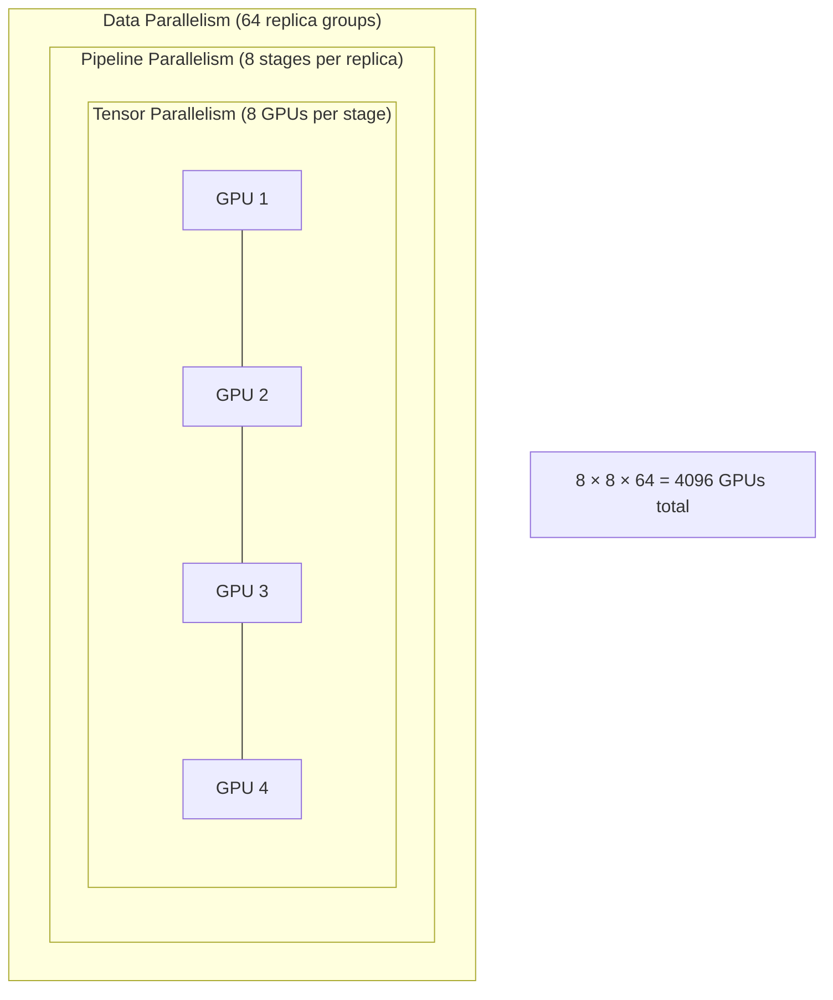
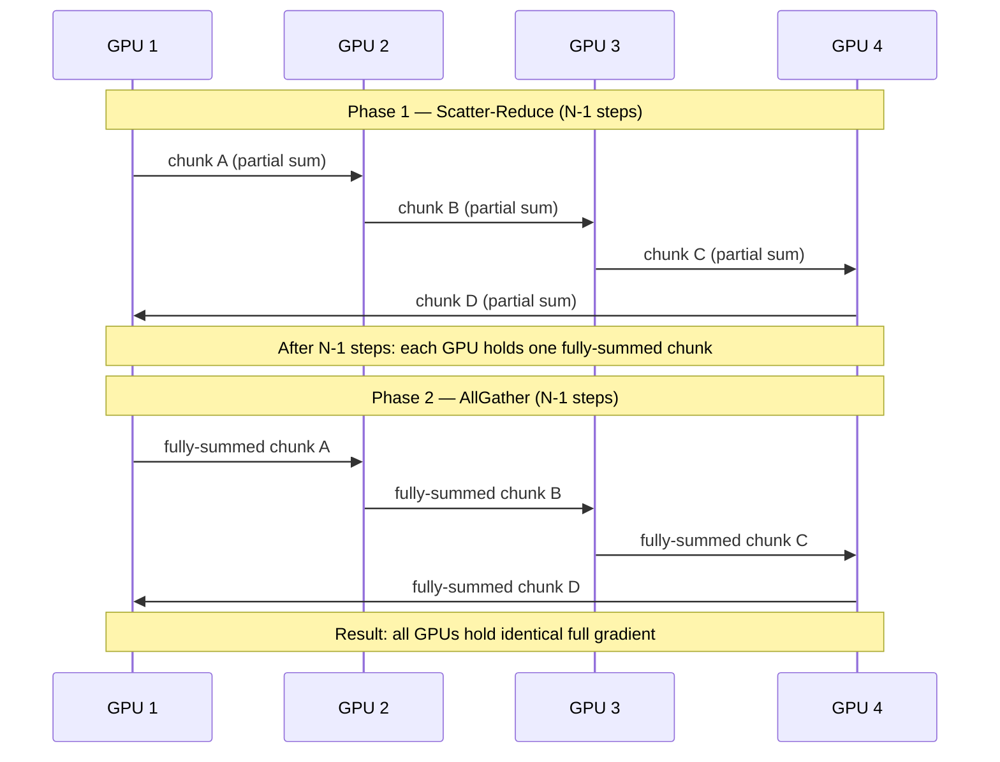
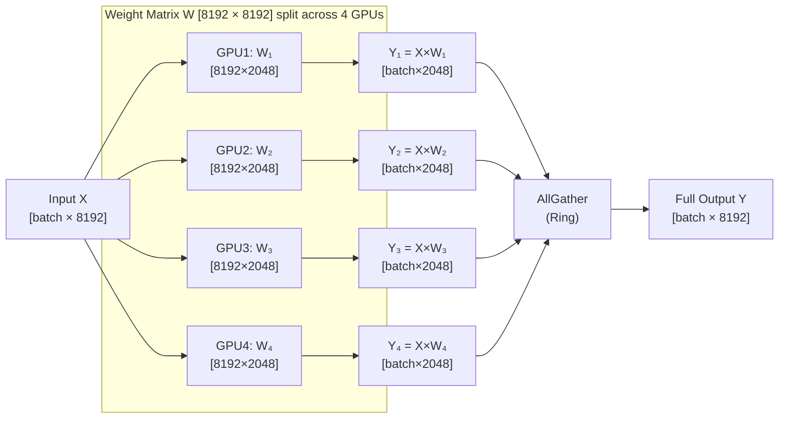
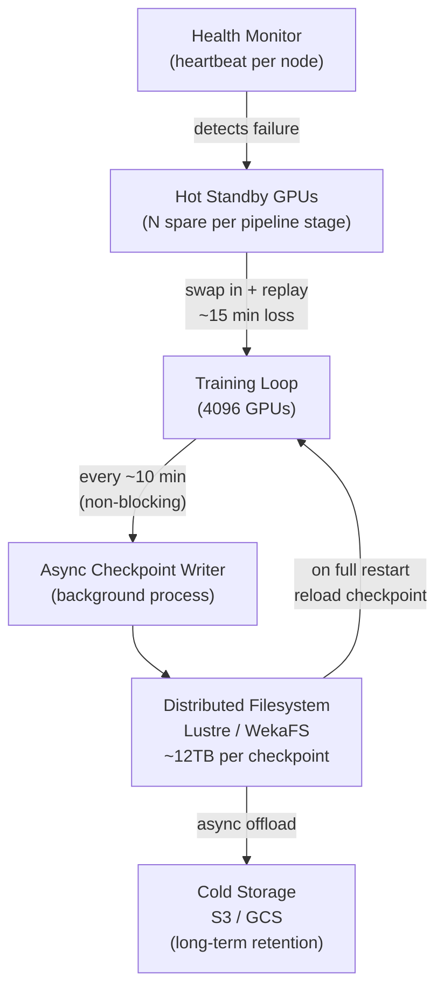
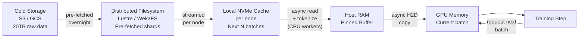

# System Design: Distributed Training System for a Trillion-Parameter Language Model

## Overview

Training a 1T parameter LLM is one of the hardest distributed systems problems in engineering today.
It combines hardware constraints, distributed computing, fault tolerance, and data engineering at extreme scale.

---

## Requirements

### Functional
- Submit and manage training jobs across thousands of GPUs
- Distribute a model that cannot fit on a single device
- Synchronize gradients across all workers after each step
- Checkpoint training state for fault recovery
- Stream training data to all workers without bottlenecks

### Non-Functional
- **Fault tolerance**: survive GPU failures without losing more than ~15 min of training
- **Throughput**: sustain high MFU (Model FLOP Utilization) — target 40–60%
- **Reproducibility**: same seed + same data order = same model
- **Scalability**: linear scaling from 100s to 1000s of GPUs

---

## Estimation

| Parameter | Value |
|---|---|
| Model parameters | 1 trillion |
| Weight memory (float32) | 1T × 4B = **4TB** |
| Adam optimizer state | momentum + variance = **8TB** |
| **Total checkpoint size** | **~12TB** |
| Training data | 10T tokens × 2B = **~20TB** |
| GPUs required (H100 80GB) | minimum ~4096 |
| Sustained data throughput needed | ~4 GB/sec |

---

## Architecture Diagram

### 3D Parallelism Overview



---

### Ring-AllReduce: Gradient Synchronization



**Key property**: Per-machine bandwidth = `2G` regardless of cluster size. Adding machines does not increase per-machine network load.

---

### Tensor Parallelism: Weight Matrix Split



**Communication cost per layer**: AllGather (forward) + AllReduce (backward) = 2 collective calls per layer × 96 layers = 192 collective calls per step. Fast interconnect (NVLink/InfiniBand) is mandatory.

---

### Pipeline Parallelism: Layer Stages + Micro-batches

```mermaid
gantt
    title Pipeline Parallelism with Micro-batches (reducing the bubble)
    dateFormat X
    axisFormat %s

    section GPU1 (Layers 1-10)
    μbatch 1 fwd   :a1, 0, 2
    μbatch 2 fwd   :a2, 2, 4
    μbatch 3 fwd   :a3, 4, 6
    bubble         :crit, 6, 8
    μbatch 3 bwd   :a4, 8, 10
    μbatch 2 bwd   :a5, 10, 12
    μbatch 1 bwd   :a6, 12, 14

    section GPU2 (Layers 11-20)
    idle           :crit, 0, 2
    μbatch 1 fwd   :b1, 2, 4
    μbatch 2 fwd   :b2, 4, 6
    μbatch 3 fwd   :b3, 6, 8
    μbatch 3 bwd   :b4, 8, 10
    μbatch 2 bwd   :b5, 10, 12
    μbatch 1 bwd   :b6, 12, 14

    section GPU3 (Layers 21-30)
    idle           :crit, 0, 4
    μbatch 1 fwd   :c1, 4, 6
    μbatch 2 fwd   :c2, 6, 8
    μbatch 3 fwd   :c3, 8, 10
    μbatch 3 bwd   :c4, 10, 12
    μbatch 2 bwd   :c5, 12, 14
    μbatch 1 bwd   :c6, 14, 16
```



The **pipeline bubble** (idle time at start/end) shrinks as number of micro-batches increases but never disappears entirely.

---

### Checkpointing & Fault Tolerance



**Recovery strategies by cost:**

| Strategy | Recovery Time | Hardware Cost |
|---|---|---|
| Full restart from checkpoint | Hours (reload 12TB) | None |
| Async checkpoint + hot standby | ~15 min | ~5% extra GPUs |
| Redundant pipeline stages | ~0 min | 2× hardware |

---

### Training Data Pipeline



**Deterministic sharding** (no coordinator needed):
```
GPU rank R owns samples: dataset[R :: world_size]
Shuffle per epoch:        shuffle(my_samples, seed=epoch_number)
```

---

## Component Breakdown

### Parallelism Strategies

| Strategy | Splits | Communication | Interconnect |
|---|---|---|---|
| **Data Parallelism** | Training data | AllReduce gradients | InfiniBand between nodes |
| **Pipeline Parallelism** | Model layers | Point-to-point activations | InfiniBand |
| **Tensor Parallelism** | Weight matrices | AllGather + AllReduce | NVLink within node |

Typical 1T config: **8-way tensor × 8-way pipeline × 64-way data = 4096 GPUs**

### Interconnect

| Link | Bandwidth | Scope |
|---|---|---|
| NVLink | 600 GB/s | Within node (8 GPUs) |
| InfiniBand HDR | 400 Gb/s | Between nodes |
| Commodity Ethernet | 25 Gb/s | Too slow for tensor parallelism |

### Storage

| Tier | Technology | Purpose |
|---|---|---|
| Hot | Local NVMe | Per-node batch cache |
| Warm | Lustre / WekaFS | Shared training data + checkpoints |
| Cold | S3 / GCS | Long-term checkpoint retention |

---

## Key Trade-offs

### CAP & Consistency
Training requires **strong consistency** on gradient aggregation — all workers must apply identical gradients or models diverge. There is no eventual consistency option here. The cost is synchronization overhead at every step.

### Synchronous vs Asynchronous Training
- **Synchronous**: all workers wait for the slowest (straggler). Consistent gradients. Used by most large-scale systems.
- **Asynchronous**: workers update independently. Higher throughput but gradients go stale. Used in some federated learning scenarios but rarely in LLM training.

### Checkpoint Frequency vs Training Speed
- More frequent checkpoints → less training loss on failure → but I/O overhead
- Fix: **async checkpointing** decouples checkpoint I/O from training loop — checkpoint every 10 min with near-zero overhead

### Pipeline Depth vs Bubble Size
- More pipeline stages → more GPUs utilized → larger bubble
- Fix: increase micro-batch count. Bubble fraction = `(p-1) / (m + p - 1)` where `p` = pipeline stages, `m` = micro-batches

---

## What to Watch Out for at Scale

### 1. Straggler GPUs kill synchronous training
In synchronous AllReduce, the entire cluster waits for the slowest GPU. One degraded node (thermal throttling, flaky NVLink) can drop cluster-wide throughput by 20–30%. Fix: health monitoring with automatic node eviction.

### 2. Silent data corruption
At 4096 GPUs running for weeks, bit flips in GPU memory happen. They don't crash training — they silently corrupt weights. The model continues training toward garbage. Fix: periodic loss spike detection + gradient norm monitoring. If gradient norm explodes, roll back to last checkpoint.

### 3. Data pipeline starvation
GPUs show 100% utilization in metrics but MFU is 15% — they're stalling on memory loads waiting for the next batch. Fix: monitor MFU directly, not just GPU utilization. Deep prefetch pipelines + local NVMe caching.

---

## Monitoring & Observability

Key metrics to track per node and aggregate:

| Metric | Why |
|---|---|
| **MFU** (Model FLOP Utilization) | True measure of training efficiency |
| **Gradient norm** | Detects silent corruption or instability |
| **Step time** | Identifies straggler nodes |
| **AllReduce latency** | Network bottleneck signal |
| **Checkpoint write time** | Storage health |
| **Loss curve** | Model learning signal |

Aggregation pattern: each node emits metrics to a **time-series store** (Prometheus/InfluxDB) via a sidecar process. A central dashboard (Grafana) shows per-node and aggregate views. Alerts fire when any node deviates >2σ from the cluster median step time.

---

## Concepts Reinforced

- **Ring-AllReduce** — bandwidth-optimal gradient synchronization
- **3D Parallelism** — data + pipeline + tensor parallelism combined
- **Pipeline bubble** — idle time in pipeline parallelism, reduced by micro-batches
- **Tensor parallelism** — splitting weight matrices, requires AllGather + AllReduce per layer
- **Async checkpointing** — non-blocking checkpoint writes
- **Hot standby** — spare GPUs for instant failover
- **Deterministic sharding** — coordinator-free data distribution
- **MFU** — true GPU efficiency metric
- **Silent data corruption** — GPU bit flips that corrupt training silently
- **NVLink vs InfiniBand** — intra-node vs inter-node interconnect trade-offs
